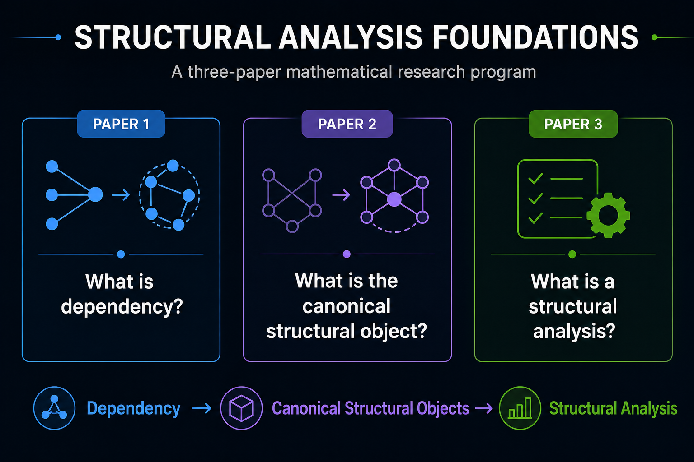

# Structural Analysis Foundations

<p align="center">
  
</p>

Structural Analysis Foundations is a three-paper research program investigating the mathematical foundations of structural analysis.

The program develops progressively:

- **Paper 1** formalizes workload-relative dependency.
- **Paper 2** defines canonical structural objects and deterministic, representation-invariant structural analysis.
- **Paper 3** investigates the minimal mathematical interface required for admissible structural analysis operators.

Together, the papers progress from a specific structural analysis, to canonical structural representations, to the general theory of structural analysis itself.

## Research Program

### Paper 1 — The Mathematics of Dependency

**Research Question:** What is dependency?

**Contribution:**
Formalizes workload-relative dependency as a mathematical object, treating dependency as a property relative to a specified workload and observational context rather than as an informal graph relation.

---

### Paper 2 — Canonical Structural Analysis

**Research Question:** What is the canonical structural object?

**Contribution:**
Develops deterministic, representation-invariant structural analysis over canonical structural objects, separating structural meaning from implementation-specific graph representations.

---

### Paper 3 — Foundations for Structural Analysis

**Research Question:** What characterizes a structural analysis?

**Contribution:**
Investigates the minimal mathematical interface required for admissible structural analysis operators and studies the foundational properties shared by structural analyses independent of any specific application.


## Research authority and artifact terms

The repository uses four separate terms:

- **Authoritative research object:** an accepted, versioned research object that fixes research meaning, including its stable schema, invariants, and evidence contract. It is authoritative only for the meaning within its declared scope.
- **Human-authored manuscript source:** paper-local `main.tex`, bibliography, included prose, figures, and appendices maintained by authors and reviewers to express the paper's narrative and typesetting. It is not a substitute for an authoritative research object.
- **Generated candidate artifact:** a rebuildable output such as `main.pdf`, an HTML preview, graph export, or validation report. It is evidence for review and has no publication status.
- **Immutable release artifact:** the reviewed, committed `pdf/paperN.pdf` (or a future versioned release bundle) published from an identified source commit and then left unchanged. A correction creates a new release artifact rather than mutating the released bytes.

For the same research meaning, authority is ordered: **authoritative research object, then human-authored manuscript source, then immutable release artifact**. If an object, `main.tex`, and a committed PDF disagree, the accepted object wins; `main.tex` and a generated candidate PDF must be corrected, validated, and published as a new immutable release artifact. A committed PDF never overrides either research meaning or manuscript source. Where no accepted research object covers a statement, the human-authored manuscript source governs that statement and a differing committed PDF is stale.

Implementations are conformance hypotheses against authoritative research objects, not the source of their authority.

Current governance and review documentation includes:

- [Minimal Promotion Contract](docs/minimal-promotion-contract.md) — the consumer-side review contract for immutable Promotion Packages and bounded formalization authorization.

Current authoritative research-object documentation includes:

- [Dependency Predicate](paper-1-dependency/research-objects/definition.dependency.dependency-predicate.json) — the first canonical object, grounded in Paper 1's workload-relative dependency predicate.
- [Reachability Profile](docs/research-objects/canonical-reachability-profile.md) — the second canonical object, a language-independent structural observation over roots and targets that demonstrates extensibility beyond a single dependency analysis.

Additional research objects should be added by defining the scientific purpose, inputs, outputs, invariants, preconditions, postconditions, evidence contract, reproducibility requirements, canonical schema, and deterministic fixture before introducing any implementation-specific adapter. This preserves the architecture:

Canonical fixtures are validated against their declared Draft 2020-12 JSON Schemas with `python tools/validate_canonical_fixtures.py` after installing `requirements.txt`; CI runs the same check before conformance adapters. See [Canonical Fixture Schema Validation](docs/canonical-fixture-schema-validation.md).

```text
Real System
  ↓
Canonical Structural Object
  ↓
Canonical Research Object
  ↓
Specific Analysis
```

## Current repository status

Immutable PDF release artifacts are present at:

- [paper-1-dependency/pdf/paper1.pdf](paper-1-dependency/pdf/paper1.pdf)
- [paper-2-canonical-structural-analysis/pdf/paper2.pdf](paper-2-canonical-structural-analysis/pdf/paper2.pdf)
- [paper-3-foundations-structural-analysis/pdf/paper3.pdf](paper-3-foundations-structural-analysis/pdf/paper3.pdf)

Current source status: `main.tex` and `references.bib` are present in each paper directory; local LaTeX builds require LaTeX tooling such as `latexmk` or `pdflatex`.


## Continuous LaTeX validation

This repository is self-validating through the GitHub Actions workflow at `.github/workflows/latex.yml`. The workflow builds each paper independently with `latexmk -pdf main.tex` in a maintained TeX Live environment:

- `paper-1-dependency/`
- `paper-2-canonical-structural-analysis/`
- `paper-3-foundations-structural-analysis/`

Each matrix job runs in the paper directory so the bibliography, cross-references, labels, included files, figures, and appendices must resolve from that paper's own source tree. A failure in any paper fails the workflow, while `fail-fast: false` lets the run report which papers passed or failed.

The workflow treats the committed PDFs under `paper-*/pdf/paper*.pdf` as immutable release artifacts and never writes to those paths. Generated candidate PDFs are transient CI outputs and are uploaded only as workflow artifacts together with `build.log` and useful auxiliary files for debugging.

### Local build instructions

To reproduce the CI build locally, install a TeX Live distribution with `latexmk`, then run each paper from its own directory:

```sh
cd paper-1-dependency && latexmk -pdf main.tex
cd ../paper-2-canonical-structural-analysis && latexmk -pdf main.tex
cd ../paper-3-foundations-structural-analysis && latexmk -pdf main.tex
```

Local builds generate the candidate artifact `main.pdf` and LaTeX auxiliary files beside each `main.tex`. Do not copy those generated files over immutable release artifacts in the `pdf/` directories. Publication requires the acceptance and release transition defined in `REPRODUCIBILITY.md`.

## Repository organization

Each paper is organized as a self-contained directory intended to hold its manuscript source, bibliography, appendices, figures, and generated PDF output.

- `paper-1-dependency/` — Paper 1: The Mathematics of Dependency
- `paper-2-canonical-structural-analysis/` — Paper 2: Canonical Structural Analysis
- `paper-3-foundations-structural-analysis/` — Paper 3: Foundations for Structural Analysis
- `figures/` — top-level figure organization by paper

Each paper can be compiled independently once its manuscript sources are present in its directory. The trilogy forms a progressive research program: Paper 1 develops workload-relative dependency, Paper 2 develops canonical structural representations, and Paper 3 develops the foundations for structural analysis.
