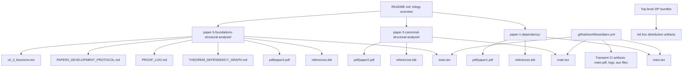
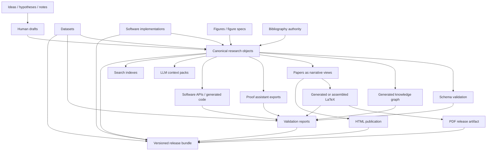

# Research Architecture Assessment

Date: 2026-07-07

## A. Executive assessment

A GitHub PDF rendering failure should be treated as a symptom of an artifact-centric publication boundary, not as the core architectural problem. The current repository is suitable for a three-paper LaTeX trilogy with reproducibility guardrails, but it is not yet an architecture for decade-scale scientific research production.

The repository previously used “canonical” for two different surfaces:

1. `main.tex` plus paper-local bibliography files are the practical manuscript sources used by the LaTeX workflow.
2. Committed PDFs under each `pdf/` directory were described as published authority.

For a system expected to scale to 50+ papers, thousands of definitions, theorem/proof objects, cross-paper dependencies, datasets, implementations, AI-assisted authoring, and future formal tooling, PDFs must never govern research meaning. They are immutable release artifacts. LaTeX should remain a high-quality human publication target and authoring interface, but it should not be the only source of truth for research semantics.

The reconciled terminology for the recommended hybrid research-object system is:

- **Human-authored manuscript source:** semantic Markdown, LaTeX fragments, or the current paper-local `main.tex` and inputs maintained by authors and reviewers.
- **Authoritative research object:** an accepted, versioned research object in a strict schema, preferably YAML or JSON-LD serialized from a typed object model; it governs research meaning within its declared scope.
- **Graph index:** generated from canonical objects, not hand-maintained as the primary source.
- **Generated candidate artifacts:** rebuildable LaTeX assemblies, PDFs, HTML, search indexes, graph exports, proof-assistant stubs, software APIs, and LLM packs awaiting validation or release.
- **Validation artifacts:** build logs, schema reports, reference checks, provenance manifests, object graph checks, reproducibility reports.
- **Immutable release artifacts:** reviewed, versioned publication PDFs or bundles containing generated PDFs, source snapshots, object manifests, checksums, datasets, software versions, and citation metadata; corrections create new artifacts rather than modifying released bytes.

The authority rule is **authoritative research object → human-authored manuscript source → immutable release artifact** for meaning covered by an accepted object. Thus, if a research object, `main.tex`, and a committed PDF disagree, the object wins and the downstream surfaces must be reconciled. If no accepted object covers the disputed content, `main.tex` wins. A committed PDF is never semantic authority; disagreement makes it a stale release.

The key architectural move is to make reusable research objects first-class. Definitions, notation, theorems, proofs, equations, claims, assumptions, citations, datasets, figures, and software implementations should have stable IDs, typed schemas, provenance, dependency edges, validation state, and publication mappings. Papers should become curated narrative views over this object graph, not isolated containers that duplicate concepts.

## Continuity coding pre-implementation record

- **Intent:** determine the correct long-term research architecture rather than patch a PDF symptom.
- **Exact scope:** repository architecture assessment and migration plan only.
- **Affected files:** this assessment document.
- **Preserved invariants:** no manuscript content changes, no PDF release-artifact changes, no workflow changes, no build behavior changes, no research semantics changes.
- **Mutation-capable surfaces identified:** LaTeX sources, bibliographies, checked-in PDFs, ZIP bundles, GitHub Actions workflow, paper-local internal proof/dependency logs, top-level documentation.
- **Replay implications:** documentation-only change; future implementation should replay the architecture decision before mutating build, publication, or research-object layers.
- **Proof requirements:** file topology inspection, workflow inspection, manuscript object inspection, current reproducibility policy inspection.
- **Validation requirements:** repository status, file inventory, documentation inspection, diff inspection, commit.
- **Unresolved ambiguity:** no repository-local error trace identifies the exact GitHub PDF rendering failure, so this assessment treats it as evidence of misplaced artifact responsibility rather than diagnosing GitHub rendering internals.

## B. Current architecture diagram



### Current architecture interpretation

The repository is primarily **paper-centric**. Each paper directory owns its manuscript, bibliography, figures, appendices, and immutable PDF release artifact. The CI workflow validates each paper independently using LaTeX. Paper 3 adds early research-governance artifacts: a proof log, theorem dependency graph, development protocol, and theorem workspace.

This is a strong architecture for a small trilogy, but it does not expose a durable cross-paper object layer. Definitions and theorems exist mostly as LaTeX labels inside manuscripts. Citations exist as paper-local BibTeX entries. PDFs and ZIP bundles are checked in beside source, but release provenance is not fully machine-verifiable.

## C. Proposed architecture diagram



## D. Canonical research object model

### Research-authority decision

The authority for research meaning should be a **typed research object graph serialized as versioned YAML or JSON-LD**, with optional generated RDF/OWL/property-graph exports.

Recommended policy:

- **Authoritative semantic layer:** accepted YAML or JSON-LD files that define typed research objects with stable IDs.
- **Canonical graph layer:** generated graph database/export derived from objects, never hand-edited as the only source.
- **Human narrative layer:** Markdown or LaTeX authored/assembled from object references.
- **Publication layer:** generated LaTeX/PDF/HTML artifacts.

Why not only LaTeX:

- LaTeX is excellent for mathematical typography and publication but weak as a canonical semantic database.
- Labels and macros are insufficient for object identity, provenance, schema validation, dependency classification, duplicate detection, software generation, LLM consumption, and proof-assistant export.
- Cross-paper reuse becomes copy/paste-oriented unless definitions and theorem statements are externalized as objects.

Why not only Markdown:

- Markdown is easier for prose and web publishing but weaker than LaTeX for mature mathematical typesetting.
- Markdown alone does not solve typed identity, proof dependency graphs, or formal validation unless paired with schemas and object metadata.

Why not only JSON:

- JSON is machine-friendly but poor for humans maintaining mathematical prose and multi-line formulas.
- YAML or JSON-LD is better for author-maintained objects; JSON can be generated for tools.

Why not only a graph:

- A graph is the correct index and dependency substrate, but editing raw graph triples is not the best authoring experience.
- The graph should be compiled from typed object files with schema validation.

Why PDFs are never research authority:

- PDFs are lossy presentation artifacts.
- They do not preserve stable semantic identity for definitions, assumptions, theorem dependencies, proof obligations, datasets, or executable provenance.
- A PDF rendering failure should not threaten the legitimacy of the research record if the object source, validation logs, and release manifest remain intact.

### Research object types

Every object should have at least:

```yaml
id: def.structural-analysis.operator
kind: definition
version: 1
status: draft|reviewed|published|deprecated
canonical_statement:
  format: latex
  text: "..."
human_title: "Structural analysis operator"
introduced_in:
  paper: paper-3-foundations-structural-analysis
  section: sec:definitions
provenance:
  authors: []
  created: YYYY-MM-DD
  modified: YYYY-MM-DD
  source_commit: null
dependencies:
  requires: []
  uses_notation: []
  cites: []
validation:
  schema: pending|passed|failed
  semantic: pending|passed|failed
exports:
  latex_label: def:structural-analysis-operator
  uri: urn:saf:def:structural-analysis:operator
```

Core object classes:

- `concept`
- `definition`
- `notation`
- `assumption`
- `axiom`
- `lemma`
- `proposition`
- `theorem`
- `corollary`
- `proof`
- `proof_obligation`
- `equation`
- `claim`
- `example`
- `counterexample`
- `figure`
- `table`
- `citation`
- `dataset`
- `software_component`
- `experiment`
- `validation_report`
- `release_manifest`

Key relationships:

- `defines`
- `refines`
- `generalizes`
- `specializes`
- `depends_on`
- `uses_notation`
- `proves`
- `assumes`
- `cites`
- `implemented_by`
- `validated_by`
- `appears_in`
- `supersedes`
- `equivalent_to`
- `conflicts_with`

## E. Recommended directory structure

The correct organization is **hybrid object-centric + graph-centric + paper-centric views**.

- Paper-centric organization remains valuable for publication workflows and author responsibility.
- Concept/object-centric organization is required for reuse, deduplication, search, AI consumption, and cross-paper dependency tracking.
- Graph-centric organization is required for validation, impact analysis, dependency ordering, and future proof/software tooling.
- Pure paper-centric organization will not scale beyond a small series because it encourages duplicate definitions and hidden cross-paper dependency drift.

Recommended structure:

```text
.
├── README.md
├── docs/
│   ├── architecture/
│   │   ├── research-architecture.md
│   │   ├── object-model.md
│   │   └── governance.md
│   ├── authoring/
│   └── publication/
├── schemas/
│   ├── research-object.schema.json
│   ├── paper.schema.json
│   ├── proof.schema.json
│   ├── citation.schema.json
│   ├── dataset.schema.json
│   └── release.schema.json
├── objects/
│   ├── concepts/
│   ├── definitions/
│   ├── notation/
│   ├── assumptions/
│   ├── theorems/
│   ├── proofs/
│   ├── equations/
│   ├── claims/
│   ├── figures/
│   ├── citations/
│   ├── datasets/
│   └── software/
├── graph/
│   ├── generated/
│   │   ├── research-graph.jsonld
│   │   ├── research-graph.ttl
│   │   ├── dependencies.graphml
│   │   └── search-index.json
│   └── reports/
├── papers/
│   ├── paper-001-dependency/
│   │   ├── paper.yml
│   │   ├── narrative.md
│   │   ├── sections/
│   │   ├── build/
│   │   └── release/
│   ├── paper-002-canonical-structural-analysis/
│   └── paper-003-foundations-structural-analysis/
├── implementations/
│   ├── python/
│   ├── rust/
│   ├── lean/
│   └── examples/
├── datasets/
│   ├── raw/
│   ├── processed/
│   ├── manifests/
│   └── checksums/
├── validation/
│   ├── rules/
│   ├── reports/
│   └── fixtures/
├── releases/
│   ├── paper-001/
│   ├── paper-002/
│   └── bundles/
├── tools/
│   ├── compile_objects.py
│   ├── render_latex.py
│   ├── validate_graph.py
│   ├── export_llm_pack.py
│   └── build_release.py
└── .github/
    └── workflows/
        ├── validate-objects.yml
        ├── build-papers.yml
        ├── validate-releases.yml
        └── publish.yml
```

For compatibility, the current `paper-*` directories can be retained temporarily and migrated under `papers/` only after object extraction and release provenance are stable.

## F. Build pipeline

Recommended complete pipeline:

```text
Idea
→ Research note / issue
→ Draft narrative
→ Object extraction or object creation
→ Schema validation
→ Dependency graph compilation
→ Semantic validation
→ Paper view assembly
→ LaTeX/HTML generation
→ PDF build
→ Artifact comparison
→ Release manifest generation
→ Publication bundle
→ Indexing and downstream exports
```

Build stages:

1. **Object compile:** parse YAML/JSON-LD object files and validate schemas.
2. **Graph compile:** derive dependency graph, citation graph, notation graph, theorem/proof graph, and paper inclusion graph.
3. **Narrative compile:** assemble paper source from narrative text plus object references.
4. **Typeset build:** render LaTeX and compile PDF.
5. **Web build:** render HTML with object IDs and backlinks.
6. **Tool export:** generate JSON, JSON-LD, RDF, GraphML, LLM packs, API docs, and proof-assistant stubs.
7. **Release build:** bundle source, generated candidate artifacts, validation reports, checksums, and metadata.

## G. Validation pipeline

Validation should be layered so that semantic failures are caught before PDF failures.

### Structural validation

- Object schema validity.
- Stable ID format and uniqueness.
- Required fields by object kind.
- Version monotonicity.
- Deprecation/supersession integrity.
- File path and URI consistency.

### Mathematical validation

- Every theorem references known definitions, assumptions, notation, and prior results.
- No theorem dependency cycles unless explicitly allowed for mutually recursive definitions.
- Proof objects discharge declared proof obligations.
- Assumptions are explicitly propagated into dependent claims.
- Notation is not reused with conflicting meaning within the same scope.
- Definitions do not duplicate existing concepts without a declared refinement/equivalence relation.

### Citation validation

- Citation keys are globally unique or namespaced.
- Every citation used by a paper exists in the bibliography authority.
- Every bibliography entry used in a release is included in the release manifest.
- Citation metadata has DOI/URL/archive fields where available.

### Artifact validation

- LaTeX builds pass.
- HTML builds pass.
- Generated PDFs are compared to release PDFs only during release validation.
- Figures are reproducible from source specs where possible.
- Datasets have checksums and licenses.
- Software examples/tests pass.
- Links are checked.
- Each paper view preserves the meaning, identity, and selected version of every authoritative research object it includes.
- Each generated candidate PDF materially matches its manuscript source and selected research objects.
- Release validation reports a committed PDF as stale when its recorded source commit or object versions trail accepted inputs, or when a fresh candidate differs materially beyond permitted metadata variation.
- Publication is blocked by any unresolved object/source/candidate mismatch.

### AI/tooling validation

- LLM packs contain only intended objects and provenance.
- Search index round-trips object IDs.
- Graph export agrees with object dependencies.
- Software generation uses validated objects, not rendered prose.

## H. Publication pipeline

Publication should be a release process, not a side effect of validation.

An accepted change moves in one direction: accepted/versioned research object (or accepted manuscript change where no object exists) → reconciled human-authored manuscript source → validated generated candidate PDF → provenance and digest capture → new immutable PDF release artifact. A later semantic or source change makes the prior release stale; it does not mutate the released bytes or transfer authority to the PDF.

```text
Validated objects
→ Frozen paper manifest
→ Generated publication sources
→ PDF/HTML artifacts
→ Reproducibility manifest
→ Checksums
→ Signed or tagged release
→ DOI/archive upload
→ Search/graph/LLM index update
```

A release bundle should contain:

- Paper PDF.
- Paper HTML.
- Generated LaTeX source or assembled source snapshot.
- Object manifest listing every included research object and version.
- Bibliography manifest.
- Figure manifest.
- Dataset manifest and checksums.
- Software implementation commit/version references.
- Build environment metadata.
- Validation reports.
- Release changelog.

## I. Migration roadmap

### Phase 0 — Freeze current semantics

- Do not reorganize files yet.
- Declare PDFs as release artifacts, not semantic source.
- Preserve existing independent paper builds.
- Keep Paper 3 internal proof/dependency logs as evidence of the needed object layer.

### Phase 1 — Add schemas and manifests

- Add `schemas/` for paper, object, citation, and release manifests.
- Add `papers/*/paper.yml` manifests referencing current source files.
- Add release manifests for current PDFs and ZIPs.
- Add checksums for PDFs and ZIPs.

### Phase 2 — Extract object inventory

- Extract definitions, theorem labels, equations, notation, claims, and citations from existing LaTeX into draft objects.
- Do not rewrite manuscripts yet.
- Generate a repository-wide object catalog and dependency graph.

### Phase 3 — Validate cross-paper semantics

- Detect duplicate definitions and notation conflicts.
- Map Paper 1 objects reused by Paper 2 and Paper 3.
- Map Paper 2 canonical structural object dependencies used by Paper 3.
- Replace hand-maintained dependency Markdown with generated graph reports while keeping narrative audit logs.

### Phase 4 — Introduce paper views

- Define paper manifests that select and order research objects.
- Allow manuscripts to cite objects by stable ID.
- Generate LaTeX snippets from object statements while preserving author-authored exposition.

### Phase 5 — Add machine exports

- JSON-LD/RDF export.
- Search index.
- LLM object packs.
- Proof-assistant stubs.
- Software API/spec generation.

### Phase 6 — Release governance

- Move ZIP bundles into release-managed paths or GitHub Releases.
- Require release manifests and validation reports before publishing PDFs.
- Add DOI/archive metadata when available.

### Phase 7 — Scale authorship and automation

- Add ownership metadata.
- Add review gates by object kind.
- Add object-level changelogs.
- Add impact analysis for changed objects.
- Add AI-assistance logs and provenance policies for generated suggestions.

## J. Concrete GitHub issues

### Issue 1 — Define repository-wide research object schema

**Title:** Add canonical research object schema for definitions, theorems, proofs, notation, claims, figures, citations, datasets, and software

**Acceptance criteria:**

- `schemas/research-object.schema.json` exists.
- Schema supports stable IDs, object kind, status, version, canonical statement, provenance, dependencies, validation state, and exports.
- At least one example object from each current paper is represented.

### Issue 2 — Add paper manifests without moving current papers

**Title:** Add paper manifests that identify source, release artifact, bibliography, figures, and included research objects

**Acceptance criteria:**

- Each current paper has a manifest.
- Manifests reference current `main.tex`, `references.bib`, and `pdf/paperN.pdf` files.
- No manuscript text or PDF artifact changes.

### Issue 3 — Add release manifests and checksums for current PDFs and ZIPs

**Title:** Record provenance and checksums for existing PDF and ZIP release artifacts

**Acceptance criteria:**

- Every checked-in PDF has a checksum and source commit reference.
- Every checked-in ZIP is either assigned release status or marked legacy/ad hoc.
- CI verifies checksum manifests do not drift unexpectedly.

### Issue 4 — Build object inventory extractor

**Title:** Extract LaTeX labels, definitions, theorems, equations, citations, and bibliography keys into a draft object catalog

**Acceptance criteria:**

- Extractor reads current `main.tex` files.
- Output includes object IDs, LaTeX labels, source file/line, paper membership, and object kind.
- Output is generated and not treated as canonical until reviewed.

### Issue 5 — Generate cross-paper dependency graph

**Title:** Generate repository-wide research dependency graph from object manifests

**Acceptance criteria:**

- Graph includes definitions, theorems, proofs, notation, citations, and paper inclusion edges.
- Graph export supports JSON-LD and GraphML.
- CI detects missing dependency targets and dependency cycles.

### Issue 6 — Add notation consistency validator

**Title:** Validate notation reuse and scope across papers

**Acceptance criteria:**

- Notation objects declare symbol, meaning, scope, and conflicts.
- Validator reports symbol reuse with incompatible meanings.
- Paper 1–3 notation is inventoried.

### Issue 7 — Add citation authority layer

**Title:** Replace paper-local-only bibliography semantics with a citation authority and paper-specific exports

**Acceptance criteria:**

- Global citation objects or bibliography authority exists.
- Paper-local BibTeX files can be generated or validated against the authority.
- Duplicate or divergent BibTeX entries are reported.

### Issue 8 — Add publication release pipeline

**Title:** Separate validation builds from publication releases

**Acceptance criteria:**

- CI validation continues to produce transient artifacts.
- Release workflow requires manifest, checksum, source commit, build environment, and validation report.
- Release workflow never runs automatically on every commit.

### Issue 9 — Add LLM/retrieval export format

**Title:** Generate machine-consumable LLM context packs from validated research objects

**Acceptance criteria:**

- Export includes object ID, statement, dependencies, provenance, paper context, and citations.
- Export excludes generated PDFs as source.
- Export is reproducible from canonical object files.

### Issue 10 — Add proof-assistant bridge spike

**Title:** Prototype export of selected definitions and theorem statements to a proof assistant stub format

**Acceptance criteria:**

- Select a small subset of Paper 1 or Paper 2 definitions/theorems.
- Export Lean/Coq/Isabelle-style skeletons with dependency comments.
- Document what cannot yet be formalized.

### Issue 11 — Replace hand-maintained theorem dependency graph with generated graph plus audit narrative

**Title:** Convert Paper 3 theorem dependency tracking into generated object graph reports

**Acceptance criteria:**

- Existing Paper 3 dependency graph entries become objects or generated report inputs.
- Human audit commentary remains in a log.
- Generated graph can be validated for missing targets and cycles.

### Issue 12 — Establish AI-assisted research provenance policy

**Title:** Define provenance rules for AI-assisted object creation, review, and publication

**Acceptance criteria:**

- Policy distinguishes suggestions, drafts, reviewed objects, and published objects.
- AI-generated changes require human-reviewed provenance before release.
- Release manifests record object provenance at a useful granularity.

## Current strengths

- Clear three-paper research program.
- Paper-local build boundaries.
- CI validates each paper independently.
- Reproducibility policy distinguishes generated candidate artifacts from immutable PDF release artifacts.
- Paper 3 already contains internal theorem/proof governance artifacts.
- Existing manuscript labels provide a seed for object extraction.

## Current weaknesses and technical debt

- Research objects are embedded in LaTeX rather than represented as reusable objects.
- Cross-paper dependencies are narrative/implicit rather than machine-validated.
- Paper-local bibliographies can diverge or duplicate entries.
- PDFs and ZIPs are checked in without complete release manifests and checksums.
- Top-level figure and paper-local figure conventions coexist.
- Paper 3 has advanced proof governance that is not yet generalized repository-wide.
- There is no object-level provenance or impact analysis.
- There is no machine-consumable export for LLMs, knowledge graphs, proof assistants, search, or software generation.

## Incorrect abstractions to avoid

- Treating GitHub PDF rendering as the research artifact problem.
- Treating PDF presence as publication legitimacy.
- Treating LaTeX labels as sufficient research object identity.
- Treating hand-written dependency Markdown as the canonical graph.
- Treating paper directories as the only durable boundary.
- Treating CI artifact generation as release publication.

## Final recommendation

Keep LaTeX as a publication and authoring target, but move canonical research semantics into validated, typed, versioned research objects. Generate graphs, paper views, PDFs, HTML, LLM packs, proof-assistant stubs, and software-facing specifications from that object layer. Maintain paper-centric workflows as views over a shared object graph, not as the source of all research identity.
