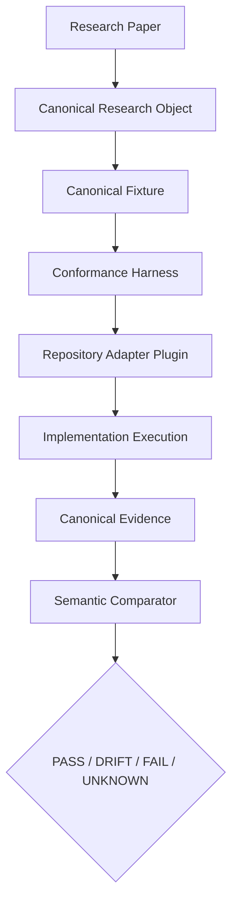

# SYNAPSE Phase 2 Conformance Harness

This module is the deterministic bridge from published research objects to implementation evidence. Papers define semantics; implementations are hypotheses; the harness decides whether observed evidence conforms.

## Topology



## Components

- `fixture_loader.py` loads canonical fixtures and verifies the fixture targets the stated research object.
- `adapter_api.py` defines the repository adapter plugin contract.
- `models.py` defines canonical fixture, evidence, and result objects.
- `engine.py` orchestrates fixture loading, adapter execution, evidence capture, comparison, and reporting.
- `comparator.py` compares semantics rather than formatting, ordering, or serialization details.
- `reporter.py` writes deterministic result artifacts.
- `adapters/dependency_algebra.py` is the first plugin adapter path for the `dependency-algebra` implementation hypothesis.
- `fixtures/dependency-predicate.fixture.json` is the first canonical fixture for Paper 1's Dependency Predicate research object.
- `schemas/evidence.schema.json` documents the canonical evidence envelope.

## Adapter Contract

Every repository adapter must implement:

1. Load canonical fixture.
2. Execute implementation.
3. Capture evidence.
4. Normalize output.
5. Return a canonical evidence object.

Core harness code must not contain repository-specific execution details. Implementation details belong in adapter plugins and fixture adapter configuration.

## Deterministic Execution

Run the first end-to-end conformance path:

```bash
python -m conformance --fixture conformance/fixtures/dependency-predicate.fixture.json
```

The command writes deterministic artifacts under `conformance/artifacts/paper1.dependency-predicate.basic-v1/`:

- `fixture.json`
- `raw-evidence.json`
- `evidence.json`
- `report.json`
- `execution.stdout`
- `execution.stderr`

A `PASS` means the implementation evidence preserves the dependency predicate semantics encoded by the canonical fixture. `DRIFT` means semantic values differ after canonicalization. `FAIL` means identity or implementation failure. `UNKNOWN` means an adapter could not establish semantics.
