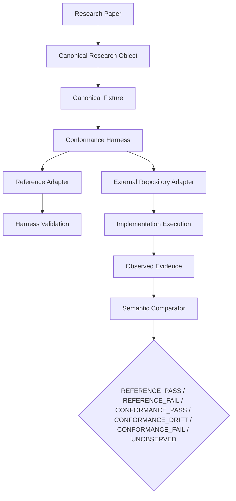

# SYNAPSE Phase 2 Conformance Harness

This module is the deterministic bridge from published research objects to implementation evidence. Papers define semantics; implementations are hypotheses; the harness decides whether observed evidence conforms.

## Current Phase 2 Boundary

This PR completes the first stage only:

```text
Research Specification
  ↓
Reference Implementation
  ↓
Harness Validation
```

It also adds the external adapter boundary needed for the next stage:

```text
External Repository Adapter
  ↓
Observed Evidence
  ↓
Semantic Comparison
  ↓
Deterministic Conformance
```

A reference result validates the harness mechanics. It is not external repository conformance. A conformance `PASS` is reserved for an independently executed implementation preserving the semantics defined by the canonical research object.

## Topology



## Components

- `fixture_loader.py` loads canonical fixtures and verifies the fixture targets the stated research object.
- `adapter_api.py` defines the repository adapter plugin contract.
- `models.py` defines canonical fixture, evidence, replay, and result objects.
- `engine.py` orchestrates fixture loading, two-pass replay execution, evidence capture, hash generation, comparison, and reporting.
- `comparator.py` compares semantics rather than formatting, ordering, or serialization details.
- `reporter.py` writes deterministic result artifacts.
- `adapters/dependency_predicate_reference.py` is the local reference adapter for validating the harness path.
- `adapters/reachability_profile_reference.py` is the bounded local reference realization for the canonical Reachability Profile.
- `adapters/dependency_algebra_external.py` is the external adapter boundary for an actual `dependency-algebra` implementation. It returns `UNOBSERVED` when the implementation is unavailable.
- `fixtures/dependency-predicate.fixture.json` is the reference fixture for Paper 1's Dependency Predicate research object.
- `fixtures/dependency-predicate.external.fixture.json` is the external fixture for dependency-algebra observation.
- `schemas/evidence.schema.json` documents the canonical evidence envelope.


## Canonical Research Object Extension Points

The conformance layer treats research objects as stable scientific artifacts. A new research object enters the architecture through documentation, schema, fixture, and evidence semantics before any implementation adapter is introduced. This keeps the harness from becoming specialized to one algorithm or one repository.

The second canonical research object is the Reachability Profile:

- specification: `docs/research-objects/canonical-reachability-profile.md`
- schema: `schemas/canonical-reachability-profile.schema.json`
- deterministic fixture: `conformance/fixtures/canonical-reachability-profile.fixture.json`

The fixture is intentionally language-independent and not bound to SYNAPSE, dependency-algebra, or any programming language. It defines expected semantics, not a complete canonical evidence envelope. Its bounded reference adapter consumes only the fixture's finite canonical structural object and workload. Adapters must produce evidence conforming to `schemas/evidence.schema.json` and compare the fixture-defined semantic projection fields: `canonical_outputs`, `structural_metrics`, `structural_invariants`, and `required_diagnostics`.

To add another research object:

1. Specify the purpose, canonical inputs, canonical outputs, invariants, preconditions, postconditions, evidence-envelope boundary, and reproducibility obligations.
2. Add a stable schema for the canonical fixture or object surface.
3. Add a deterministic fixture suitable for replay and independent conformance testing; the fixture should define expected semantics rather than pretending to be adapter-produced evidence.
4. Only then add an adapter that emits the canonical evidence envelope, keeping implementation execution outside core harness semantics.

## Adapter Contract

Every repository adapter must implement:

1. Load canonical fixture.
2. Execute implementation.
3. Capture evidence.
4. Validate raw evidence against `schemas/evidence.schema.json`.
5. Normalize output.
6. Return a canonical evidence object.

Core harness code must not contain repository-specific execution details. Implementation details belong in adapter plugins and fixture adapter configuration.

## Evidence and Provenance

Every evidence artifact must include repository identity, repository URL, commit SHA, branch, implementation version, command executed, tool version, fixture hash, canonical input hash, canonical evidence hash, environment metadata, and working tree cleanliness when available.

The schema intentionally permits extension inside `diagnostics`, `generated_artifacts`, semantic maps, and `provenance` so future adapters can carry implementation-specific proof details without changing core harness identity fields.

## Replay Determinism

Every fixture is executed twice:

- `run-a/evidence.json`
- `run-b/evidence.json`
- `replay.json`

The harness compares canonical evidence hashes. Observed runtime timestamps are preserved as reality in `observed_execution_timestamp`; deterministic comparison uses `canonical_projection_timestamp` and a canonical projection that excludes the observed runtime timestamp.

## Deterministic Execution

Validate the reference harness path:

```bash
python -m conformance --fixture conformance/fixtures/dependency-predicate.fixture.json
```

Execute the bounded Reachability Profile reference realization:

```bash
python -m conformance --fixture conformance/fixtures/canonical-reachability-profile.fixture.json
```

The canonical result is written to exactly:

```text
conformance/artifacts/paper3.reachability-profile.basic-v1/reachability-profile-reference/evidence.json
```

Observe the external adapter boundary:

```bash
python -m conformance --fixture conformance/fixtures/dependency-predicate.external.fixture.json
```

External adapter outcomes are intentionally distinct:

- `UNOBSERVED`: no implementation was discovered, so execution was never attempted and no conformance determination is possible.
- `CONFORMANCE_PASS` / `CONFORMANCE_DRIFT`: an implementation was discovered, execution completed, and semantic comparison succeeded or drifted.
- `CONFORMANCE_FAIL`: an implementation was discovered, execution was attempted, and the process failed or emitted failing evidence. Non-zero execution is observed evidence and is never reported as `UNOBSERVED`.

If `dependency-algebra` is unavailable, the external path reports `UNOBSERVED`, never `PASS`. If it is available but exits non-zero, the external path reports `CONFORMANCE_FAIL`.

The command writes deterministic artifacts under `conformance/artifacts/<fixture-id>/<adapter-name>/`:

- `run-a/evidence.json`
- `run-b/evidence.json`
- `evidence.json`
- `report.json`
- `replay.json`
- `fixture.sha256`
- `evidence.sha256`
- `report.sha256`
